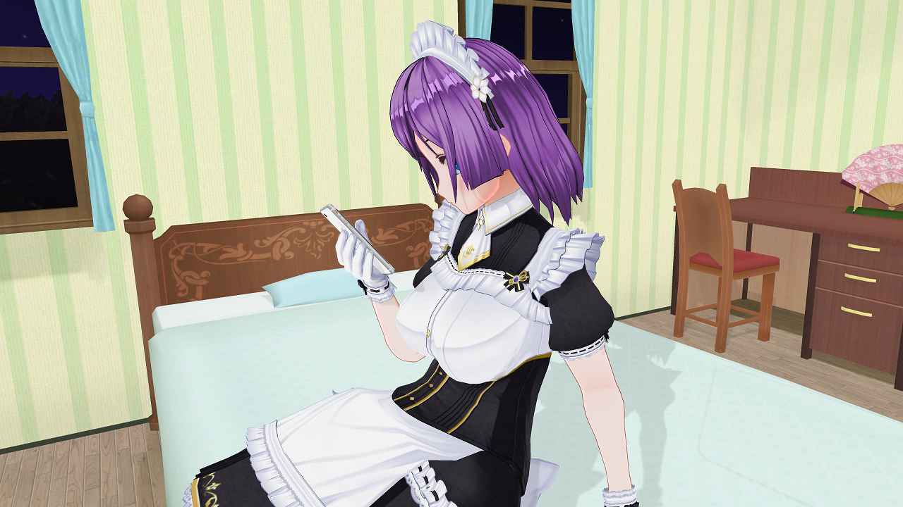

# Activity Relay Server

## Yet another powerful customizable ActivityPub relay server written in Go.

## Packages

 - `github.com/yukimochi/Activity-Relay`
 - `github.com/yukimochi/Activity-Relay/worker`
 - `github.com/yukimochi/Activity-Relay/cli`

## Requirements

 - [Redis](https://github.com/antirez/redis)

## Installation Manual

See [GitHub wiki](https://github.com/yukimochi/Activity-Relay/wiki)

## Environment Variable

 - `ACTOR_PEM` (ex. `/actor.pem`)
 - `RELAY_DOMAIN` (ex. `relay.toot.yukimochi.jp`)
 - `RELAY_SERVICENAME` (ex. `YUKIMOCHI Toot Relay Service`)
 - `RELAY_BIND` (ex. `0.0.0.0:8080`)
 - `REDIS_URL` (ex. `redis://127.0.0.1:6379/0`)

## Appended HTTP Header

 - `X-Relay-ActivityHost` Indicates an activity domain.

## License
